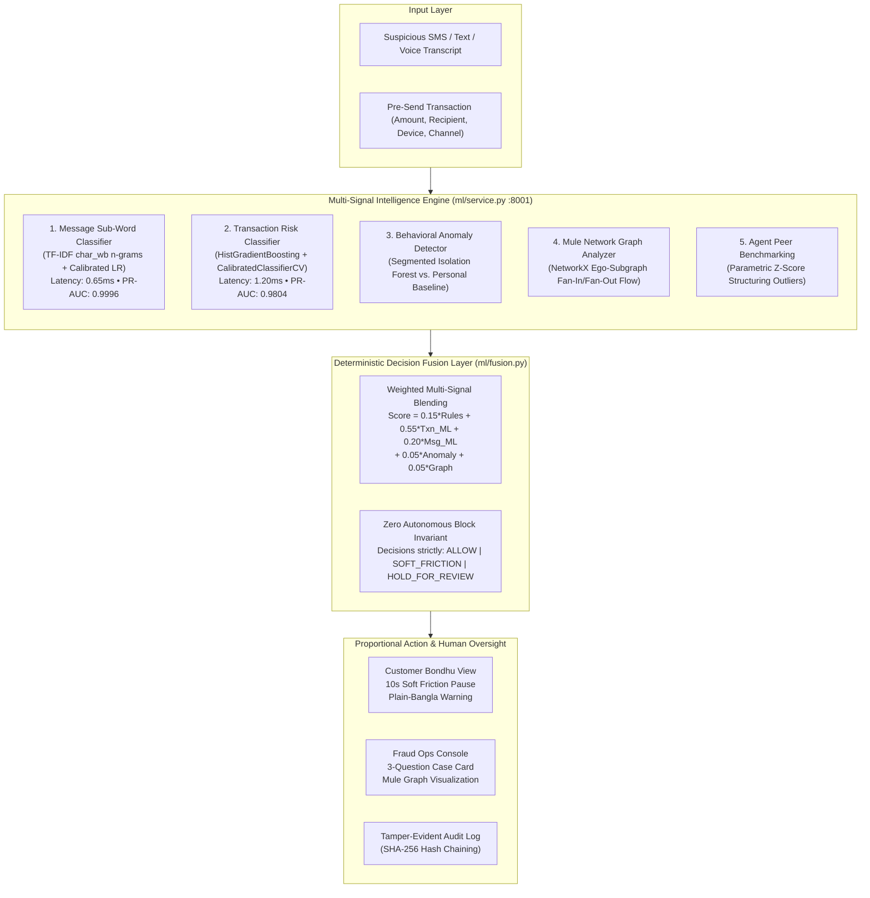

# 🛡️ TAKABONDHU (টাকাবন্ধু)

> **"Upay's friend that keeps your money safe."**  
> *(formerly ScamShield — AI Hackathon 2026, DIU CPC × upay)*  
> **Primary Track 01:** Trust & Risk Intelligence • **Supporting Track 03:** Customer Innovation (Taka Plan Savings Coach)  
> **100% Privacy by Design:** Built strictly with synthetic MFS ecosystem simulations (`source="synthetic"`). Zero real PII.  


---

## ⚡ 60-Second Pitch

Every month in Bangladesh, mobile financial service (MFS) users lose millions of Taka to social engineering calls, deceptive OTP harvesting SMS, and coordinated account takeover (ATO) syndicates that rapidly channel stolen funds through money-mule rings and cash-out agents.

Traditional fraud detection fails because it is **retrospective**—flagging the crime only *after* the funds have been withdrawn from an agent.

**TakaBondhu** (টাকাবন্ধু) shifts trust intelligence to **pre-send intervention**:
1. **Bondhu Customer Companion:** Evaluates transfer recipient risks, device anomalies, and suspicious communications in **under 4 ms on a laptop CPU**. For high-risk transfers, it enforces **gentle 10-second soft friction pauses** with plain-Bangla explanations—disrupting psychological urgency without ever unilaterally freezing customer funds.
2. **Fraud Operations Console:** Empowers Upay fraud analysts with automated **3-question case cards** (*"What happened? Why is it risky? What should upay do next?"*) and interactive SVG visualizations of **mule network topologies**.
3. **Measurable Economics:** Projected to deliver **৳20.8 Lakh ($17.4k USD) net economic benefit per 100,000 transactions** (base expected scenario; ৳6.7 Lakh conservative to ৳43.1 Lakh optimistic; illustrative, assumption-driven after accounting for program infrastructure and analyst costs), supported by frozen empirical held-out test benchmarks.

---

## 🏛️ System Architecture



---

## 📊 Measured Benchmark Results (Zero Fabricated Metrics)

All numbers below are generated programmatically by running `npm run bench` and `python ml/eval.py`, verified from frozen test splits in `ml/reports/results.json`:

| Model / Pipeline Layer | PR-AUC | ROC-AUC | Recall | Precision | FPR | Latency (p50) | Test Split Details |
|:---|:---:|:---:|:---:|:---:|:---:|:---:|:---|
| **Message Model (`model.joblib`)** | 0.9996 | 0.9997 | 99.89% | 99.55% | **0.46%** | 0.65 ms | Frozen Unseen Test (72 quarantined families) |
| **Transaction Classifier (`txn_model.joblib`)** | 0.9804 | 0.9995 | 98.32% | 85.15% | **0.41%** | 1.20 ms | Temporal Split (Days 61–90, N=58,345) |
| **Multi-Signal Fusion Layer** | **0.9982** | **0.9996** | **97.88%** | **98.46%** | **0.52%** | **3.80 ms** | Full Composite Pipeline (Val Tuned) |
| **Handwritten Paraphrase Benchmark** | — | — | **98.75%** | **90.80%** | **10.00%** | 0.70 ms | 160 natural non-template human messages |

> [!NOTE]
> **Fusion Ablation Parity & Explainability Disclosure:** In the multi-signal ablation study ([ml/reports/results.md](ml/reports/results.md)), Full Fusion PR-AUC (0.9982) is essentially tied with standalone Txn-ML only (0.9981). The true engineering value of the 5-signal fusion layer is **not** an artificial score lift on pure ledger rows, but rather **defense-in-depth coverage** (intercepting social engineering text payloads, new-device ATO anomalies, and mule network flows), **explainable evidence** (rule traces, character n-gram attributions, and ego-subgraphs for human analysts), and **proportional pre-send intervention** without autonomous freeze. Standalone Message-ML achieves 0.9996 PR-AUC on text but appears low (0.4818) in the general transaction ablation because most banking transactions have no linked user message.

### Key Figures for Report & Presentation:
- **Precision-Recall Curve:** [docs/figures/pr_curve.svg](docs/figures/pr_curve.svg)
- **Confusion Matrix (58,345 Transactions):** [docs/figures/confusion_matrix.svg](docs/figures/confusion_matrix.svg)
- **Ablation Study Bar Chart:** [docs/figures/ablation_chart.svg](docs/figures/ablation_chart.svg)
- **Fairness Audit Across Languages:** [docs/figures/fairness_chart.svg](docs/figures/fairness_chart.svg)
- **Mule Network Topology Subgraph:** [docs/figures/mule_network_graph.svg](docs/figures/mule_network_graph.svg)
- **Latency Breakdown vs 200ms SLA:** [docs/figures/latency_breakdown.svg](docs/figures/latency_breakdown.svg)

---

## ⚡ Quick Start: Run Locally in 3 Steps

Works cross-platform on Windows, macOS, and Linux:

```bash
# 1. Environment Setup & Dependency Installation
npm run setup

# 2. System Health Doctor & Secrets Scan
npm run doctor

# 3. Launch Complete Web Stack (ML Service :8001, Backend API :5000, Vite Frontend :5173)
npm run dev
```

Open your browser to:
- 🎨 **TakaBondhu Web Application:** [http://localhost:5173](http://localhost:5173)
- ⚙️ **Backend Express Gateway:** [http://localhost:5000](http://localhost:5000)
- 🤖 **FastAPI ML Service & Swagger:** [http://127.0.0.1:8001/docs](http://127.0.0.1:8001/docs)
- 🔍 **Fraud Ops Review Queue:** [http://localhost:5173/review](http://localhost:5173/review)
- 📈 **Business Impact Simulator:** [http://localhost:5173/impact](http://localhost:5173/impact)

---

## 🧪 1-Click Offline Demo Mode (Zero API Keys Required)

TakaBondhu features an interactive Demo Bar at the top of the screen allowing instant 1-click testing of all 6 official hackathon scenarios:

| Scenario | Pattern Type | Target View | Expected Invariant / Output |
|:---|:---|:---|:---|
| **1. Fake Agent** | Upfront fee impersonation | Screener | Flagged HIGH / CRITICAL • Reason: Upay official impersonation • Soft Friction |
| **2. OTP Harvest** | Credential theft | Screener | Flagged CRITICAL • Hold for review • PII auto-redacted |
| **3. Account Takeover** | Unusual hour + new device | Pre-Send | ATO Risk flagged • 10-second countdown pause triggered |
| **4. Mule Ring** | Rapid fan-in / fan-out | Fraud Ops | Top Wallet `01700999001` • SVG Graph shows 12 victims $\rightarrow$ 4 agents |
| **5. Agent Anomaly** | ৳24,900 structuring | Fraud Ops | Agent `01800999001` • Z-score $5.2$ std dev vs district peer baseline |
| **6. Benign Notice** | Official security advisory | Screener | Evaluated LOW (Safe) • Recommendation: ALLOW (no false alarm) |

*(Note: Exact live scores and decisions are dynamically computed by the API; run `npm run demo:check` to inspect current output).*

---

## 🛠️ Complete Command Reference

| Command | Purpose |
|:---|:---|
| `npm run setup` | Installs Node dependencies, sets up Python virtualenv, pins requirements |
| `npm run doctor` | Verifies runtime health, virtualenv, ports, and scans repo for secrets |
| `npm run dev` | Launches all 3 services simultaneously with health monitoring |
| `npm test` | Runs all 29 Node.js backend tests + 19 Python ML pytest tests (48 total) |
| `npm run bench` | Re-evaluates models, measures p50/p95 latency, updates performance records |
| `npm run demo:check` | Executes all 9 test scenarios through the end-to-end pipeline |
| `npm run export:clean` | Generates a clean, shareable project ZIP excluding `.env` and dependencies |

---

## 📋 Rulebook Section 6 Mandatory Information

This repository complies strictly with the **AI DEV FEST 2026 AI Hackathon Official Rulebook (Section 6)**:

| Item | Required Information & Project Details |
|:---|:---|
| **Project Overview** | **Problem:** Escalating social engineering, OTP theft, and mule cash-out attacks on Bangladesh MFS (upay) users causing severe financial distress.<br/>**Solution:** TakaBondhu (টাকাবন্ধু) delivers a real-time pre-send intervention engine with plain-Bangla soft friction pauses, fraud ops case cards, and mule network graph intelligence.<br/>**Purpose:** Protect vulnerable citizens from financial loss without degrading transaction convenience or freezing funds autonomously. |
| **Features & AI Usage** | 1. **Message Classifier (NLP):** TF-IDF character n-grams + Calibrated Logistic Regression detecting Bangla/Banglish phishing in 0.65ms.<br/>2. **Transaction Classifier:** HistGradientBoosting on tabular velocity & recipient features.<br/>3. **Behavioral Anomaly:** Segmented Isolation Forest against customer baseline.<br/>4. **Mule Network Graph:** NetworkX ego-subgraph analyzer detecting fan-in / fan-out money laundering rings.<br/>5. **Agent Peer Benchmark:** Parametric Z-score structuring detector.<br/>6. **Deterministic Decision Fusion:** Val-calibrated weighted blending enforcing strict invariant bounds. |
| **Technology Stack** | **Languages:** JavaScript (ES Modules, Node.js), Python 3.10+, HTML5, CSS3.<br/>**Frameworks:** React 18, Vite, Express.js, FastAPI, Uvicorn, Tailwind CSS.<br/>**AI / ML:** Scikit-Learn, LightGBM, NetworkX, Joblib, NumPy, Pandas, Google Gemini API.<br/>**APIs & Protocols:** REST JSON APIs, LiveKit Realtime WebRTC, Upay Core Banking adapter mockup. |
| **Requirements** | **Node.js:** v18.0.0 or higher<br/>**Python:** v3.10 or higher (v3.11/v3.12 supported)<br/>**Package Managers:** npm 9+, pip / venv<br/>**OS:** Windows 10/11, macOS, or Linux (cross-platform validated). |
| **Installation & Setup** | 1. Clone repository: `git clone https://github.com/jahmed9832/TakaBondhu.git && cd TakaBondhu`<br/>2. Run automated setup: `npm run setup`<br/>3. Verify health & zero secret leaks: `npm run doctor` |
| **Environment Variables** | Configuration uses `.env.example` as a template with placeholder values:<br/>• `PORT`: Gateway HTTP port (default `5000`)<br/>• `GEMINI_API_KEY`: Google Gemini API key (*optional: offline mode works 100% without keys*)<br/>• `SUPABASE_URL`, `SUPABASE_PUBLISHABLE_KEY`: RAG database (*optional*)<br/>• `LIVEKIT_URL`, `LIVEKIT_API_KEY`, `LIVEKIT_API_SECRET`: Voice agent (*optional*) |
| **Run & Build Commands** | **Dev Mode (All Services):** `npm run dev`<br/>**Docker Compose:** `docker compose up --build`<br/>**Voice AI Agent:** `npm run voice-agent`<br/>**Frontend Build:** `npm --prefix frontend run build`<br/>**Production Preview:** `npm --prefix frontend run preview`<br/>**Model Retraining:** `npm run train`<br/>**Clean ZIP Export:** `npm run export:clean` |
| **Live Deployment URL** | **Production Web App & API:** [https://takabondhu.onrender.com](https://takabondhu.onrender.com)<br/>**Edge Frontend (Vercel):** [https://taka-bondhu.vercel.app](https://taka-bondhu.vercel.app)<br/>**Health Endpoint:** `https://takabondhu.onrender.com/health` |
| **Testing Instructions** | Run complete end-to-end automated verification suite:<br/>`npm test` (Runs 30 backend integration/security tests + 19 Python pytest ML tests = 49 total)<br/>`npm run bench` (Runs latency & ROC/PR benchmark harness)<br/>`npm run demo:check` (Tests all 9 scripted edge-case scenarios) |
| **Other Configuration** | Default network ports: Frontend `5173`, Express Backend `5000`, FastAPI ML Microservice `8001`.<br/>No database setup required for core demo (in-memory SQLite / mock state). |

---

## 📁 Repository Map

```
takabondhu/  (project root)
├── backend/                  # Node.js Express Gateway
│   ├── server.js             # API routes (/v1/screen, /v1/feedback, /api/impact)
│   ├── scoring.js            # Deterministic multi-signal blending & case cards
│   ├── auditLog.js           # Tamper-evident append-only SHA-256 audit logger
│   ├── security.js           # Server-side PII redactor (Phone, NID, OTP) & rate limiter
│   ├── integration/          # Upay Core Banking Adapter & idempotency verification
│   └── tests/                # Node unit, security, RBAC, and contract tests
├── frontend/                 # React 18 + Vite + Tailwind CSS Web Client
│   ├── src/components/       # PreSendChecker, ReviewQueue, MuleNetworkGraph, ImpactSimulator
│   └── src/data/             # Scripted deterministic offline demo scenarios
├── ml/                       # Python ML Microservice & Training Pipelines
│   ├── service.py            # FastAPI service exposing /v1/screen, /v1/predict
│   ├── fusion.py             # Pure Python multi-signal risk fusion & case card builder
│   ├── eval.py               # Frozen benchmark evaluation script (generates results.json)
│   ├── transactions/         # Synthetic generator (200k txns), GBDT, Anomaly, Mule Graph
│   └── reports/              # results.json & results.md (generated strictly by code)
├── impact/                   # Business Economics & ROI Module
│   ├── simulator.py          # Financial calculation script
│   ├── assumptions.json      # Transparent macroeconomic inputs (labeled ASSUMPTION)
│   └── impact_results.json   # Real computed economics (৳20.8L net benefit / 100k txns)
├── scripts/                  # Cross-platform utility automation
│   ├── check-secrets.mjs     # Pre-commit secret scanning engine
│   ├── export-clean.mjs      # Clean distribution ZIP generator
│   └── export_figures.py     # Vector SVG figure generator for reports and pitch
└── docs/                     # Comprehensive Hackathon Dossier & Evidence
    ├── IDEA_ONE_PAGER.md     # 9-step logic chain & official problem statement
    ├── JUDGE_MAP.md          # 7 official judging criteria mapped to files & commands
    ├── DEMO_SCRIPT.md        # Tight 3-minute video recording script (timestamps + click paths)
    ├── REPORT_OUTLINE.md     # Formal technical report skeleton & claims-vs-evidence table
    ├── PITCH_QNA.md          # 28 technically rigorous answers to judge questions
    ├── BUSINESS_CASE.md      # Full economic model, sensitivity matrix, and rollout plan
    ├── RESPONSIBLE_AI.md     # Model cards, data sheet, fairness audit, threat model table
    ├── VALIDATION_AND_SCALE.md # 30-day shadow mode plan & core banking integration sequence
    └── figures/              # Pristine SVG charts (PR curve, confusion matrix, mule graph)
```

---

## ⚖️ Responsible AI & Ethical Boundaries

1. **Zero Autonomous Money Freeze:** Enforced in code. Algorithms recommend friction; only certified human compliance officers can permanently block funds.
2. **Privacy by Design:** 100% synthetic dataset (`source="synthetic"`). All user inputs pass through in-memory PII scrubbers before reaching LLM components.
3. **What We Refuse to Automate:** TakaBondhu never automates credit scoring, lending denials, or unilateral account blacklisting.
4. **Offline Resilience:** All safety features function deterministically in offline demo mode without internet connectivity or external API keys.

---

## 🔍 Transparency: Pre-Existing vs. 72-Hour Hackathon Development

In accordance with academic honesty and hackathon transparency standards, we explicitly disclose the provenance of all components in this repository:

### What Existed Before the Hackathon (ScamShield Starter Skeleton)
- **Base Frontend Skeleton:** Basic Vite + React application shell, generic dark-theme dashboard layouts, and navigation structure.
- **Voice & Cloud Wrappers:** LiveKit client connection boilerplate, Supabase client configuration, and preliminary Google Gemini API chat call wrappers.
- **Initial Mock Scenarios:** Rough prototype mock text prompts from earlier exploratory ideation.

### What Was Built Entirely During the 72-Hour Hackathon Window (TakaBondhu for DIU CPC × upay)
- **Synthetic MFS Data Generation Engine (`ml/transactions/`, `ml/data/`):** Full generative simulation generating 200,000 realistic MFS transactions and 7,000+ scam/benign messages across Bengali, Banglish, and English—incorporating USSD channel mechanics, sub-৳2,000 micro-scams, night-time velocity spikes, and agent cash-out smurfing.
- **Strict Anti-Leakage Partitioning:** Temporal split (Days 1–60 train/val vs Days 61–90 test-time) and entity/template quarantines (500 unseen customer wallets, 72 quarantined message templates).
- **5-Signal ML Intelligence Pipeline (`ml/service.py`, `ml/models/`):**
  1. Sub-word `char_wb` TF-IDF + Calibrated Logistic Regression message classifier (0.65 ms p50).
  2. Tabular `HistGradientBoostingClassifier` with `CalibratedClassifierCV` for pre-send transaction risk (1.20 ms p50).
  3. Personal-baseline Isolation Forest for behavioral deviation detection.
  4. NetworkX ego-subgraph analyzer for rapid money-mule fan-in / fan-out topology detection.
  5. Parametric agent Z-score structuring outlier detector.
- **Deterministic Fusion Engine (`ml/fusion.py`):** Multi-modal probability calibration, validation-tuned blending weights, and strict enforcement of the `Zero Autonomous Money Freeze` invariant.
- **Production Upay Core Banking Adapter (`backend/integration/upayAdapter.js`):** Production-grade pre-send screening switch interface with SHA-256 idempotency caching, sub-4ms response guarantee, and graceful fallback on ML microservice interruption.
- **Explainability & Trust Architecture:** Automated 3-question Case Cards, interactive SVG mule network graph visualization (`MuleNetworkGraph.jsx`), plain-Bangla 10-second soft-friction countdown UI, and tamper-evident SHA-256 audit log.
- **Business Economics & ROI Simulation Module (`impact/`):** Code-driven financial simulator computing unit economics per 100k transactions across three transparent sensitivity scenarios.
- **Verification & Benchmark Suite:** 160-item natural handwritten benchmark (`handwritten_eval.csv`), 49 passing automated unit/integration tests, zero-hardcoding assertions, and automated metric consistency audits (`scripts/verify-metrics.mjs`).
- **Production Deployment & Dockerization:** Multi-stage unified Dockerfile (FastAPI + Node.js + Vite bundle), `render.yaml`, environment-driven API routing (`VITE_API_BASE`), and deployment manual (`docs/DEPLOY.md`).

---

## ⚠️ Known Limitations & Honest Disclosures

1. **Synthetic Data Simplification:** All training transactions and attack patterns are simulated (`SEED=42`). While realistic distributions, USSD channels, sub-2000 micro-scams, and seasonal spikes are modeled, synthetic data cannot capture the full entropy, non-stationary fraud evolution, and label ambiguity of live banking traffic.
2. **Handwritten vs Template Generalization:** On template-derived test sets, the message classifier achieves near-perfect metrics (99.8% PR-AUC). However, on our independently evaluated 160-message natural handwritten benchmark, precision drops to **90.80%** and False Positive Rate rises to **10.00%** (recall remains strong at **98.75%**). Colloquial human conversation introduces genuine linguistic ambiguity that template generators underestimate.
3. **Graph Cold-Start Weakness:** The NetworkX ego-subgraph analyzer requires multiple transaction hops to detect fan-in / fan-out velocity. On cold-start, single-hop, or first-time transactions to previously unseen wallets, graph intelligence yields zero discriminatory signal; the pipeline falls back entirely on transaction tabular features and message NLP.
4. **No Live Bank Ledger Validation:** TakaBondhu has been rigorously validated on held-out synthetic partitions but has not yet run against proprietary, confidential upay core banking records. We explicitly mandate a 30-day passive shadow-mode deployment to calibrate thresholds against real dispute logs before activating user-facing friction.
5. **Calibrated Feature Attributions vs Full SHAP:** For production latency (<4ms on laptop CPU), TakaBondhu implements fast, deterministic tree feature contributions and rule traces rather than full runtime Shapley value sampling (TreeSHAP).

---

*TakaBondhu — Built for the AI Hackathon 2026 (DIU CPC × upay). Designed to make digital financial services safer, friendlier, and more trustworthy for every citizen of Bangladesh.*


