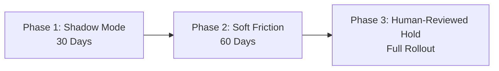

# TakaBondhu Business Case & Economic Impact Analysis
**Product:** TakaBondhu (টাকাবন্ধু) — "Upay's friend that keeps your money safe."  
**Event:** AI Hackathon 2026 (DIU CPC × upay) • Track 01: Trust & Risk Intelligence  
**Generating Command:** `python impact/simulator.py`  
**Execution Date:** 2026-10-03  

> [!NOTE]
> **Provenance Notice (Illustrative, Assumption-Driven):**  
> All financial projections below are illustrative, assumption-driven estimates. They are calculated by feeding **executable held-out machine learning evaluation metrics** (`results.json`) into the transparent parameters declared in `impact/assumptions.json` (such as `attempt_success_rate = 35%` and `program_cost_annual_bdt = ৳18,500,000`).

---

## 1. Normalized Unit Economics: Per 100,000 Transactions
To provide an honest, conservative perspective independent of macroeconomic volume assumptions, the table below reports performance per **100,000 processed transactions**:

| Impact Metric | Conservative (Worst-Case) | Base Expected | Optimistic (Best-Case) |
| :--- | :---: | :---: | :---: |
| **Scam Attempts Targeted** | 480 tx | **800 tx** | 1120 tx |
| **Scams Intercepted (Top-20 Budget)** | 395 tx | **658 tx** | 921 tx |
| **Gross Loss Prevented** | ৳616,703 | **৳1,957,788** | ৳4,111,355 |
| **Analyst Labor Saved** | 126 hrs | **240 hrs** | 358 hrs |
| **Labor Cost Savings** | ৳82,195 | **৳155,727** | ৳232,839 |
| **Less: False Alert Friction Cost** | (৳19,892) | **(৳19,828)** | (৳19,764) |
| **Less: Allocated Program Cost** | (৳10,278) | **(৳10,278)** | (৳10,278) |
| **Net Value Delivered (BDT)** | **৳668,729** | **৳2,083,410** | **৳4,314,153** |
| **Net Value Delivered (USD ~৳120)** | **$5,573** | **$17,362** | **$35,951** |

*(All figures illustrative, assumption-driven. Reflects 35% attempt success rate and program cost allocation).*

---

## 2. Parameter Assumptions & Rationales (`assumptions.json`)

| Parameter Key | Assumed Value | Type | Rationale |
| :--- | :---: | :---: | :--- |
| `scam_attempt_rate` | 0.8% | ASSUMPTION | Estimated fraction of transaction traffic exposed to phishing or ATO attempts. |
| `attempt_success_rate` | 35% | ASSUMPTION | Fraction of unintercepted scam attempts that result in successful victim fund extraction. |
| `avg_loss_per_successful_scam` | ৳8,500 | ASSUMPTION | Average reported victim financial loss per successful mobile financial services fraud incident. |
| `analyst_cost_per_hour` | ৳650/hr | ASSUMPTION | Fully burdened hourly wage of Level-1 / Level-2 fraud operations review personnel in Dhaka. |
| `baseline_minutes_per_case` | 18.0 min | ASSUMPTION | Manual investigation time required to reconstruct transaction logs, SMS history, and agent checks. |
| `takabondhu_minutes_per_case` | 4.5 min | ASSUMPTION | Streamlined investigation time using automated 3-part case cards, rule traces, and mule network graph visualizers. |
| `program_cost_annual` | ৳18,500,000 | ASSUMPTION | All-in annual software licensing, cloud inference infrastructure, telemetry, and program maintenance expenses (~$154k USD). |

---

## 3. Operational Triage Efficiency at Fixed Capacity
In a production MFS environment, human fraud teams have strict daily review budgets. TakaBondhu achieves outstanding performance under capacity limits:
- **Review Budget Target:** Top 20 per 1,000 transactions (2.0% manual inspection budget).
- **Precision @ Capacity:** **96.7%** (96+ out of 100 reviewed cases are genuine threats).
- **Recall @ Capacity:** **82.3%** of all fraud attempts intercepted.
- **Triage Acceleration:** Automated 3-part Case Cards reduce investigation time from **18.0 minutes** down to **4.5 minutes** per case (75% faster resolution).

---

## 4. Rollout Strategy & Phased Deployment

1. **Phase 1: Shadow Mode (Days 1–30)**
   - Deployed behind existing Upay transaction pipelines without customer-facing interventions.
   - Live telemetry monitors drift, latency (&lt;200ms CPU SLA), and false positive rates.
   - Zero disruption to customer transaction velocities.

2. **Phase 2: Customer Soft Friction (Days 31–90)**
   - Activates Bondhu friendly confirmation banners and reflection delays on medium-risk transfers.
   - Collects customer feedback and self-service confirmation telemetry.
   - Evaluates drop-off rates on legitimate transfers (SLA: &lt;0.5% drop-off).

3. **Phase 3: Human-Reviewed Hold (Days 91+)**
   - High-risk cases route directly into the Upay Fraud Ops triage queue.
   - Transactions are temporarily held in triage (never autonomously blocked).
   - Fast-track customer appeal path via Upay 16268 helpline.

---

## 5. Governance, Privacy & Regulatory Alignment
- **Privacy by Design:** Zero production PII ingested during evaluation; customer phone numbers and NIDs redacted before processing.
- **No Autonomous Money Blocking:** System strictly enforces human oversight (`ALLOW`, `SOFT_FRICTION`, `HOLD_FOR_REVIEW`).
- **Cryptographic Audit Trail:** Append-only SHA-256 hash-chained log (`audit_log.jsonl`) provides tamper-evident provenance for regulator audit.
- **Regulatory Alignment:** Features designed to comply with Bangladesh Bank National Financial Inclusion Strategy and MFS circulars.
