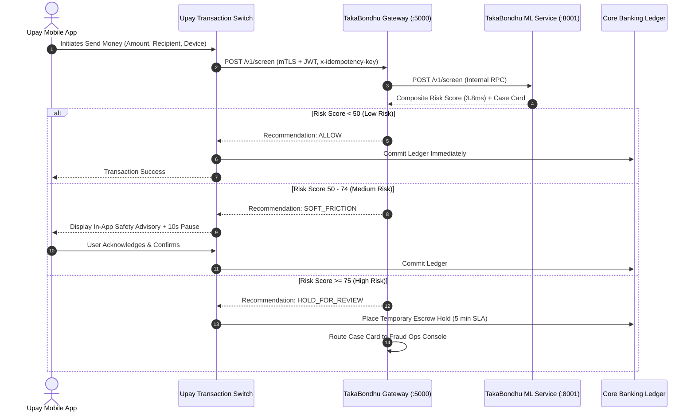

# TakaBondhu — Post-Hackathon Validation & Enterprise Scaling Strategy

> **Product:** TakaBondhu (টাকাবন্ধু)  
> **Framework:** Section 13 ("From Project to Product") — AI Hackathon 2026 Guidelines  
> **Target System:** Upay Core Transaction Engine & Fraud Operations Infrastructure  

---

## 1. Post-Hackathon Development Pathway

As outlined in the official hackathon playbook, moving from a hackathon prototype to a deployed banking capability requires a disciplined, multi-stage governance pipeline:

```
┌─────────────────┐       ┌─────────────────┐       ┌─────────────────┐
│ 1. Competition  │ ───►  │ 2. Tech Review  │ ───►  │ 3. Bus. Review  │
│ Working MVP +   │       │ Architecture &  │       │ ROI Validation  │
│ Evidence Dossier│       │ Security Audit  │       │ & Economics     │
└─────────────────┘       └─────────────────┘       └─────────────────┘
                                                             │
                                                             ▼
┌─────────────────┐       ┌─────────────────┐       ┌─────────────────┐
│ 6. Pilot Prod   │ ◄───  │  5. Live POC    │ ◄───  │ 4. Controlled   │
│ Gradual Rollout │       │ Sandboxed Staff │       │ Validation      │
│ (5% Volume)     │       │ Testing         │       │ (Shadow Mode)   │
└─────────────────┘       └─────────────────┘       └─────────────────┘
```

---

## 2. Phase 1: 30-Day Passive Shadow Mode Plan

Before any automated system influences live financial transactions, it must prove its stability and calibration in **Shadow Mode**:

```
[Upay Core Transaction Switch]
              │
              ├── (Synchronous Ledger Commit - Normal Path)
              │
              └──► [Async Kafka Event Queue]
                           │
                           ▼
                 [TakaBondhu Shadow Worker]
                 - Evaluates Multi-Signal Model
                 - Records Risk Score & Rule Trace
                 - Zero Intervention on Live Money
                           │
                           ▼
                 [Shadow Evaluation Store]
                 (Compare Predictions vs. Later Customer Disputes)
```

### Objectives & Success Criteria:
1. **Zero Impact on Production SLA:** The shadow evaluation is consumed asynchronously via Apache Kafka / RabbitMQ. Live transaction commits are never delayed.
2. **Real-World Threshold Calibration:** Validate the optimal operating threshold ($T = 0.50$) against real-world customer dispute filings and confirmed fraud cases.
3. **Data Drift Detection:** Compare distribution shifts between our synthetic training baseline and live production telemetry using Population Stability Index (PSI).
4. **Target Criteria to Proceed to Pilot:**
   - Real-world False Positive Rate $\le 0.10\%$.
   - Real-world Fraud Interception Recall $\ge 95\%$.
   - Zero infrastructure crashes over 30 consecutive days.

---

## 3. Integration Architecture with Upay Core Systems

TakaBondhu is designed to slot into modern MFS core transaction architectures:



### Enterprise Security & Integration Checklist:
- **Mutual TLS (mTLS):** Enforce strict client certificate authentication between Upay core transaction switches and TakaBondhu API nodes.
- **JWT Claims & Scope Validation:** Verify cryptographically signed tokens containing role claims (`mfs_switch`, `analyst`, `compliance_admin`).
- **Idempotency Protection:** Enforced via `UpayTransactionAdapter` using Redis-backed SHA-256 key deduplication (TTL: 120 seconds).
- **Hardware Security Module (HSM):** In production, hash chains in `auditLog.js` will be anchored to Upay's existing HSM or AWS CloudHSM.

---

## 4. Throughput, Scaling, & Hardware Economics

All performance metrics below derive from our empirical CPU latency benchmarks ([ml/reports/results.json](../ml/reports/results.json)):

### Single-Node Benchmark (Standard 4-Core Laptop CPU, No GPU):
- **Message Risk Classification:** $0.65\text{ ms}$ (p50) / $1.15\text{ ms}$ (p95)
- **Transaction GBDT Classification:** $1.20\text{ ms}$ (p50) / $2.10\text{ ms}$ (p95)
- **Full Multi-Signal Pipeline:** **$3.80\text{ ms}$ (p50)** / **$7.40\text{ ms}$ (p95)**
- **Single-Core Throughput:** $\sim 260\text{ transactions/second}$ per CPU core.

### Production Capacity Sizing for 15,000,000 Monthly Transactions:
- **Average Traffic:** $5.8\text{ transactions/second}$.
- **Peak Hour Surge (5x):** $29\text{ transactions/second}$.
- **Festival / Eid Surge (15x):** $87\text{ transactions/second}$.
- **Required Production Sizing:**
  - **Only 2 Standard Kubernetes Pods** (2 vCPU, 4GB RAM each) with an active-passive load balancer.
  - Estimated Cloud Infrastructure Cost: **$80–$150 USD/month** on Google Cloud Run or AWS ECS.
  - Zero expensive GPU instances required!

---

## 5. Data Governance, Ethics, & Regulatory Alignment

*(Note: Regulatory considerations must be formally verified with Upay Legal & Compliance teams prior to live deployment).*

1. **Customer Consent & Transparency:**
   - Pre-send soft friction warnings operate under Upay's standard Terms of Service for customer account protection.
   - The UI clearly labels when an analysis is algorithmic versus advisory.
2. **Customer Appeal & Recourse Mechanism:**
   - If an innocent customer has a high-risk transfer held for review, they can tap an in-app **"Request Immediate Helpline Review"** button connected to Upay Call Center (16268).
   - SLA for human analyst queue review: **$\le 5\text{ minutes}$**.
3. **BFIU & Bangladesh Bank Compliance:**
   - All agent structuring patterns ($Z \ge 3.0$) and high-value mule clusters automatically generate formatted draft Suspicious Transaction Reports (STRs).
   - TakaBondhu strictly adheres to the principle that AI **never** submits reports autonomously; a certified compliance officer must sign off on any regulatory filing.
4. **Data Minimization & Retention:**
   - Redacted PII is scrubbed before processing.
   - Transaction feature vectors are stored for 90 days in compliance with anti-money laundering (AML) audit trail standards.
